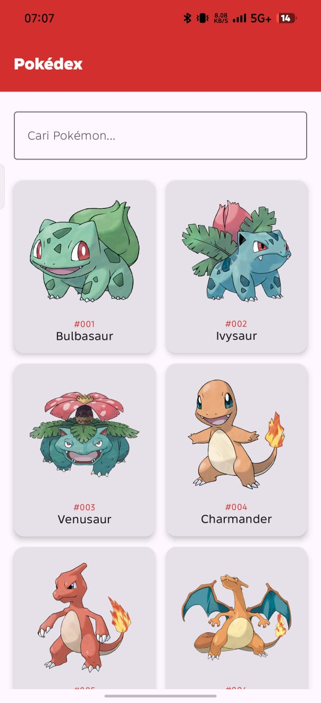
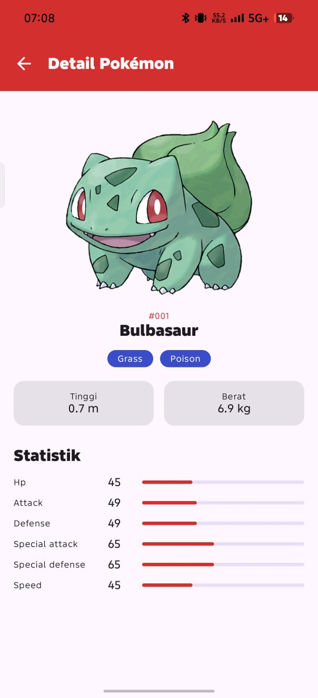

# [Pokédex]

---

## 👤 Identitas Praktikan
- **Nama :** Kadhim Ahmad Barakbah
- **NIM:** H1D024035
- **Shift Awal:** Shift C
- **Shift Akhir:** Shift C
- **Link Video Demo/Penjelasan:** [YouTube/Google Drive](https://youtu.be/zPmg1mKDKW8)

---

## 📱 Deskripsi Aplikasi
Pokédex adalah aplikasi Android untuk mencari dan melihat informasi Pokémon (tipe, tinggi, berat, dan statistik) dari PokéAPI, supaya penggemar Pokémon tidak perlu membuka banyak situs untuk mendapatkan datanya.
---

## 🛠️ Penjelasan Teknis

### 1. Spesifikasi & Tech Stack
- **Bahasa:** Kotlin 2.2.10
- **UI Framework:** Jetpack Compose (Material 3)
- **Min SDK:** 24 | **Target SDK:** 37
- **Pola Arsitektur:** MVVM (View, ViewModel, Repository, API Service, Data Model)
- **Library Utama:**
  - `Navigation Compose` (perpindahan Home dan Detail)
  - `ViewModel` dan `StateFlow` (state management)
  - `Retrofit` + `Gson` (networking dan parsing JSON)
  - `Coil` (memuat gambar dari URL)
  - `Kotlin Coroutines` (proses asynchronous)

### 2. Fitur Utama
- **Daftar Pokémon:** Menampilkan 151 Pokémon pertama dalam grid dua kolom (`LazyVerticalGrid`). Tiap kartu berisi gambar, nomor ID, dan nama.
- **Pencarian:** Search bar memfilter daftar berdasarkan nama. Filter berjalan di sisi aplikasi karena seluruh data sudah dimuat, jadi tidak ada request tambahan.
- **Loading dan Error state:** Saat data diambil tampil indikator loading. Kalau gagal (misalnya tidak ada internet), tampil pesan error dan tombol "Coba Lagi".
- **Detail Pokémon:** Klik kartu untuk membuka layar detail: gambar, nama, ID, tipe, tinggi, berat, dan enam statistik dasar dalam bentuk bar.

### 3. Struktur Direktori Proyek
app/src/main/java/com/responsi/pokemon/
├── data/
│   ├── model/        # Pokemon.kt (data class + extension function)
│   └── repository/   # PokemonRepository
├── network/          # PokemonApiService (endpoint), ApiClient (instance Retrofit)
├── ui/
│   ├── components/   # PokemonItemCard, StatBar (composable reusable)
│   ├── navigation/   # AppNavigation (NavHost)
│   ├── screen/       # HomeScreen, PokemonDetailScreen
│   ├── theme/        # Color, Theme, Type
│   └── viewmodel/    # PokemonViewModel (UiState)
└── MainActivity.kt

## 📸 Tangkapan Layar (Screenshots)

| Screen 1 | Screen 2 | Screen 3 |
|:---:|:---:|:---:|
|  |  |

---

## 🚀 Cara Menjalankan Proyek

1. **Prasyarat:**
   - Android Studio (Koala / Ladybug / versi terbaru disarankan).
   - JDK 17 atau lebih baru.
   - Perangkat fisik Android dengan USB Debugging aktif atau Emulator (API level disesuaikan).

2. **Langkah:**
   ```bash
   # Clone repository
   git clone <URL_REPOSITORY>

3. Buka folder proyek di **Android Studio**.
4. Tunggu proses **Gradle Sync** selesai.
5. Pilih target perangkat/emulator, lalu klik tombol **Run (`Shift + F10`)**.
